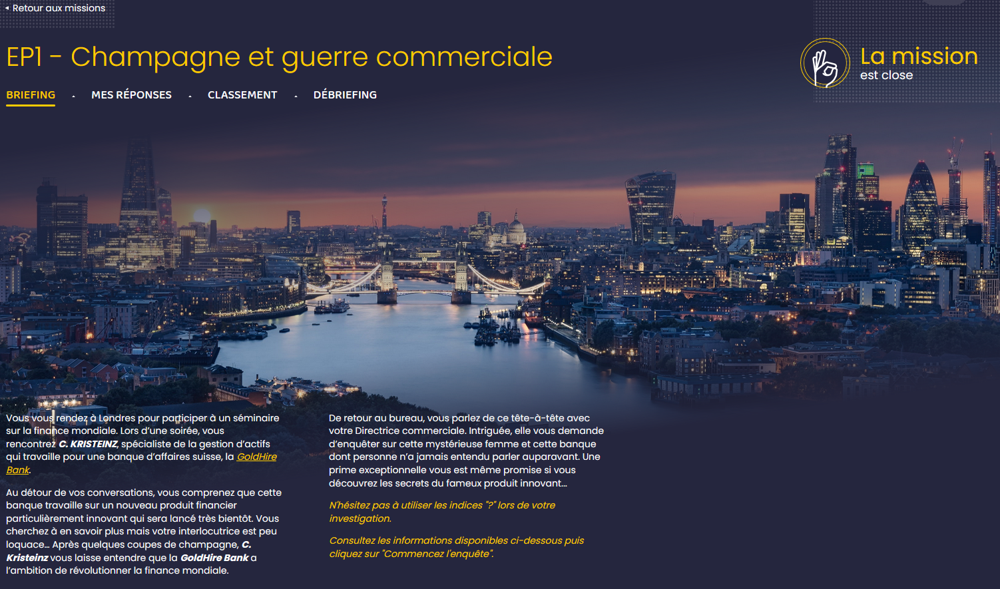
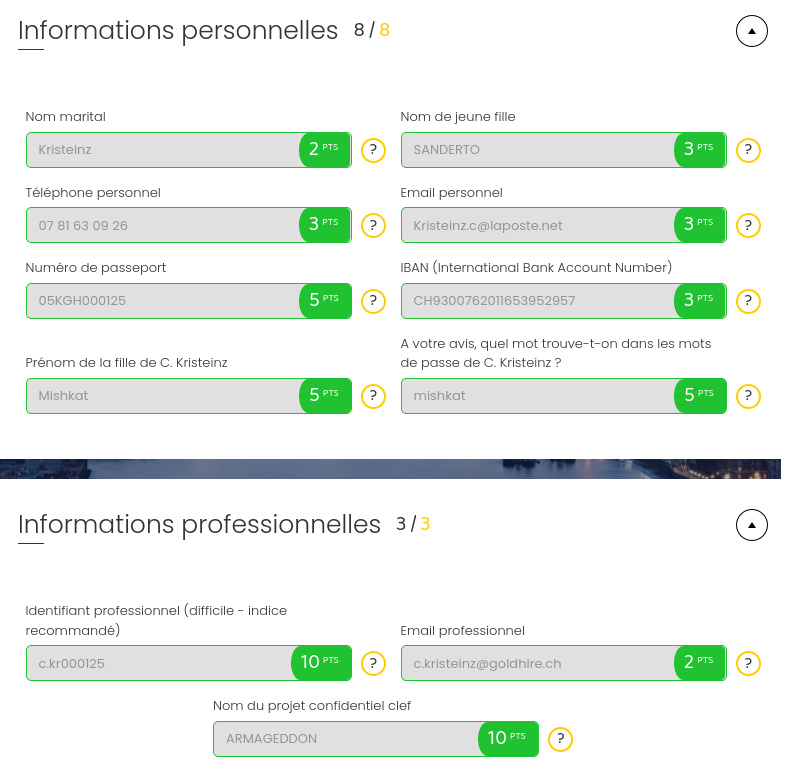

Pour cette première enquête, nous allons travailler avec 3 partie :

  - Briefing
  - Méthodologie de réflexion
  - Mes réponses (11 questions)
  
Un classement et un débriefing sont débloqués lorsque l'enquête est terminée.

## BRIEFING
 
Vous vous rendez à Londres pour participer à un séminaire sur la finance mondiale. Lors d’une soirée, vous rencontrez C. KRISTEINZ, spécialiste de la gestion 
d’actifs qui travaille pour une banque d’affaires suisse, la GoldHire Bank.

Au détour de vos conversations, vous comprenez que cette banque travaille sur un nouveau produit financier particulièrement innovant qui sera lancé très bientôt. 
Vous cherchez à en savoir plus mais votre interlocutrice est peu loquace… Après quelques coupes de champagne, C. Kristeinz vous laisse entendre que la GoldHire Bank 
a l’ambition de révolutionner la finance mondiale.

De retour au bureau, vous parlez de ce tête-à-tête avec votre Directrice commerciale. Intriguée, elle vous demande d’enquêter sur cette mystérieuse femme et 
cette banque dont personne n’a jamais entendu parler auparavant. Une prime exceptionnelle vous est même promise si vous découvrez les secrets du fameux 
produit innovant...

 
## METHODOLOGIE
 
Je part donc sur notre outil le plus bavard, GOOGLE. Avec une simple recherche sur le nom de C.Kristeinz, des résultats ressortent sur des sites comme Facebook, twitter, linkedin, etc... Parfait !

Je cherche dans un premier temps les informations "personnelles" :
  - Nom marital
  - Nom de jeune fille
  - Téléphone personnel
  - Email personnel 

Ca tombe bien, cette personne a un profil sur linkedin. En fouillant un peu, son profil nous emmène tout droit sur son NAS perso...
  => http://163.172.145.97/nas/
  
 
 
C'est une mine d'or, on y trouve son CV donc les 4 premières informations ci-dessus. 

Les informations suivantes concernent :
  - Numéro de passeport (une image passeport.png est sur le NAS)
  - IBAN (un fichier PDF RIB_Bank est sur le NAS)
  - Prénom de sa fille 
  - Mot contenu dans les mots de passe
 
Pour le prénom de sa fille, celà ne se trouve pas sur le NAS, allons voir donc du côté des réseaux sociaux. Facebook fera largement l'affaire !
Je regarde du côté des photos, une petite fille est présente en photo de couverture avec comme description "visite chez les grands parents". Le prénom de "Mishkat" ressort.

L'une des première chose pour trouver un mot de passe utilisateur, en règle général, est de chercher du côté des animaux, des enfants, des lieux d'habitations, etc.
Pour le coup, le prénom de sa fille est présent dans certains mots de passe ainsi que le nom de chanteur que cette personne apprécie.

Passont maintenant à la partie "professionnelle" qui est un peu plus dur :
  - Identifant professionnel
  - Email professionel
  - Nom du projet confidentiel clef

Je retourne sur le NAS du côté partie "Pro". J'y trouve un rapport de stage "confidentiel" fait par un stagiaire très bavard. Le nom du leader d'un projet secret ultra sensible nommé "ARMAGEDON" y est présent.

Rien de plus n'est présent sur le NAS. Je part donc du côté des photos que j'ai trouvées sur Facebook auparavant. Certaines photos sont prises en télé-travail avec une belle vue sur l'écran de l'ordinateur (et un mot de passe TINDER au passage), nous donnant son adresse mail professionnelle. 

Il ne me reste plus que l'identifiant professionnelle (nom de session) et j'avoue y avoir passé un peu de temps. J'ai fouillé tous les sites ressortis par la recherche google, toutes les photos en détails pour au final retourner sur le NAS. Je me suis demandé d'où sont sortis les fichiers EXCEL, présent dans la partie professionnelle, contenant des informations financières sur les plus gros clients de la banque. 

Un petit tour dans les metadonnées du fichier EXCEL (fichier -> informations) et ça n'a pas loupé. Ces fichiers sortent tout droit de la banque, je récupère l'identifiant professionnel et j'ai fini toutes les questions demandées.

## REPONSES 

## ANSSI

Tout au long de l'enquête, l'ANSSI propose des recommendations. Par exemple, paramétrer correctement le partage NAS afin de limiter l'accès ou encore de faire attention au photos misent sur les réseaux sociaux. 

## BONUS

A la fin de l'enquête, l'ANSSI propose de gagner des points bonus en choissant le bon mot de passe.

